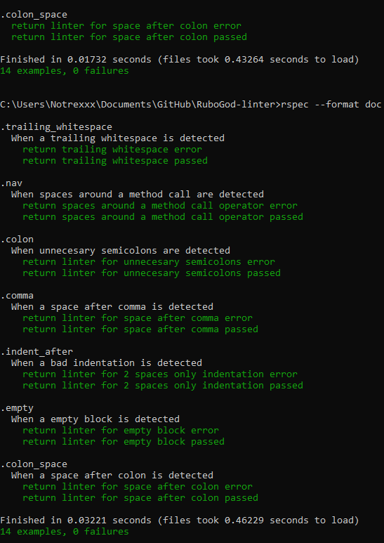

# RuboGod-linter
 RuboGod is a linter for ruby that will suggest changes to the style of the code


# Built With

- Ruby

# Linter check list

- Checks for trailing whitespaces
- Checks for spaces around a method call operator
- Checks for unnecesary semicolons
- Checks for spaces after commas
- Checks for bad indentations
- Checks for empty blocks
- Checks for spaces after colon

# How the linter works

- The linter will check for errors on the example test files called goodtest.rb and badtest.rb
- Run the application and press enter


# Prerequisites

### On Windows:
- Have Ruby installed
- Have rspec installed
### Mac & Linux:
- Latest version of Ruby installed
- Have rspec installed

# Getting Started

- Run this command in your OS terminal: `git clone https://github.com/notrexxx/RuboGod-linter.git` to get a copy of the project.

# Usage

### Windows:

- Start a new Terminal 
- Go to the directory where you cloned the RuboGod linter
- Type:
```
 cd bin
```
and press ENTER

- Type:
```
 ruby main.rb 
```
and press ENTER

### Mac & Linux::

- Start a new Terminal 
- Go to the directory where you cloned the RuboGod linter
- Type: 
```
cd bin
```
and press ENTER

- Type:
```
 $ ruby main.rb
```

# Rspec



- Start a new Terminal 
- Go to the directory where you cloned the repository
- Type:
```
bundle install
```
and press ENTER
- Now, type:
```
rspec
```
and press ENTER
# Author

👤 **Andres Leon**

- GitHub: [@notrexxx](https://github.com/notrexxx)
- Twitter: [@emigdioleon1](https://twitter.com/emigdioleon1)
- LinkedIn: [Emigdio Leon](https://linkedin.com/emigdio-leon-689109195)


# Show your support

Give a ⭐️ if you like this project!

# Contributing

Contributions, issues, and feature requests are welcome!

Feel free to check the [issues page](https://github.com/notrexxx/RuboGod-linter/issues).

# Acknowledgments

- Stand Up Team

# 📝 License

This project is [MIT](./LICENSE) licensed.
