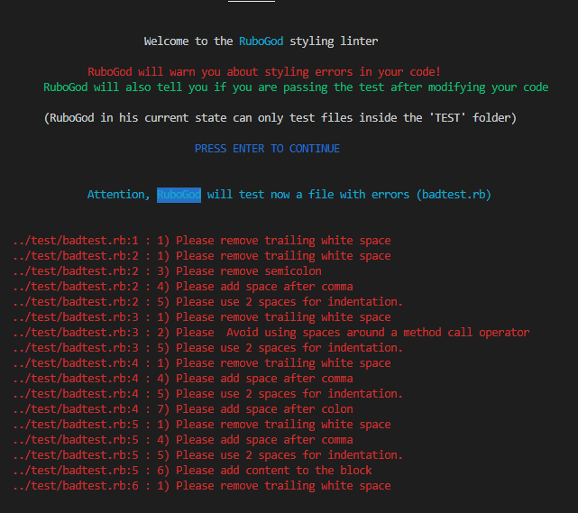

# RuboGod-linter
 RuboGod is a linter for ruby that will suggest changes to the style of the code




## Built With

- Ruby

## Prerequisites

### On Windows:
- Have Ruby installed
- Have rspec installed
### Mac & Linux:
- Latest version of Ruby installed
- Have rspec installed

## Getting Started

- Run this command in your OS terminal: `git clone https://github.com/notrexxx/RuboGod-linter.git` to get a copy of the project.

## Setup

* Clone the repository
- Go to the "Code" section of this repository and press the green button that says "Code". Copy the URL or the SSH key.
- Go to the terminal and enter:
```
git clone URL/SSH key
```
- If you don't have git you can download this project and unzip it.

## Usage

### Windows:

- Start a new Terminal 
- Go to the directory where you cloned the game
- Type:
```
 cd bin
```
and press ENTER

- Type:
```
 ruby main.rb 
```
and press ENTER

### Mac & Linux::

- Start a new Terminal 
- Go to the directory where you cloned the game
- Type: 
```
cd bin
```
and press ENTER

- Type:
```
 $ ruby main.rb
```

## Rspec

- Start a new Terminal 
- Go to the directory where you cloned the repository
- Type:
```
 rspec
```
and press ENTER


## Author

👤 **Andres Leon**

- GitHub: [@notrexxx](https://github.com/notrexxx)
- Twitter: [@emigdioleon1](https://twitter.com/emigdioleon1)
- LinkedIn: [Emigdio Leon](https://linkedin.com/emigdio-leon-689109195)


## Show your support

Give a ⭐️ if you like this project!

## Contributing

Contributions, issues, and feature requests are welcome!

Feel free to check the [issues page](https://github.com/notrexxx/RuboGod-linter/issues).

## Acknowledgments

- Stand Up Team

## 📝 License

This project is [MIT](./LICENSE) licensed.
